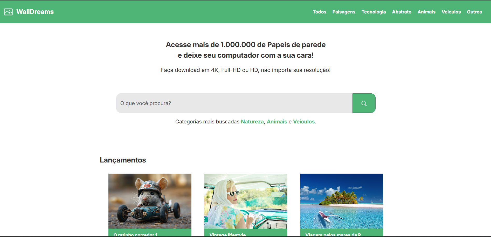

# 🌟 Walldreams

Walldreams é um **layout de site** para baixar wallpapers, desenvolvido com **HTML, CSS, SASS e Bootstrap**. O projeto busca oferecer uma interface **intuitiva e responsiva** para os usuários acessarem e baixarem imagens de alta qualidade.

## 🚀 Tecnologias Utilizadas

🔹 **HTML5** - Estrutura do site  
🔹 **CSS3** - Estilização básica  
🔹 **SASS** - Estilização avançada e organização do CSS  
🔹 **Bootstrap** - Framework para responsividade e componentes  

